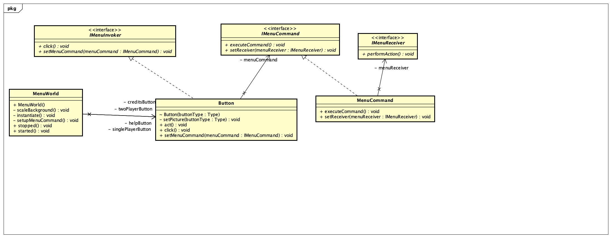
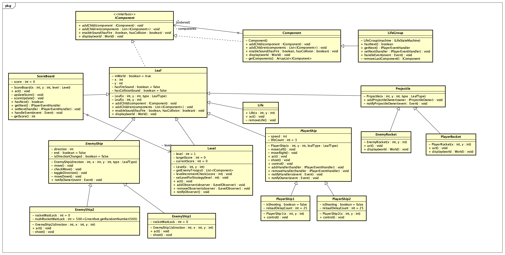
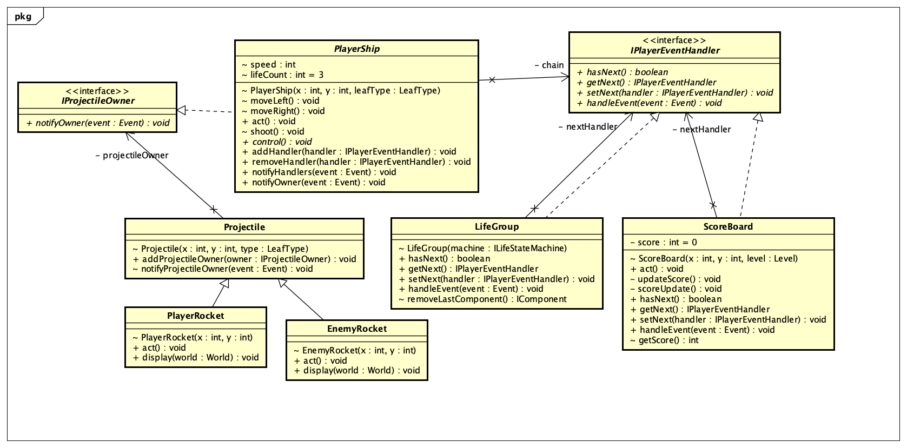
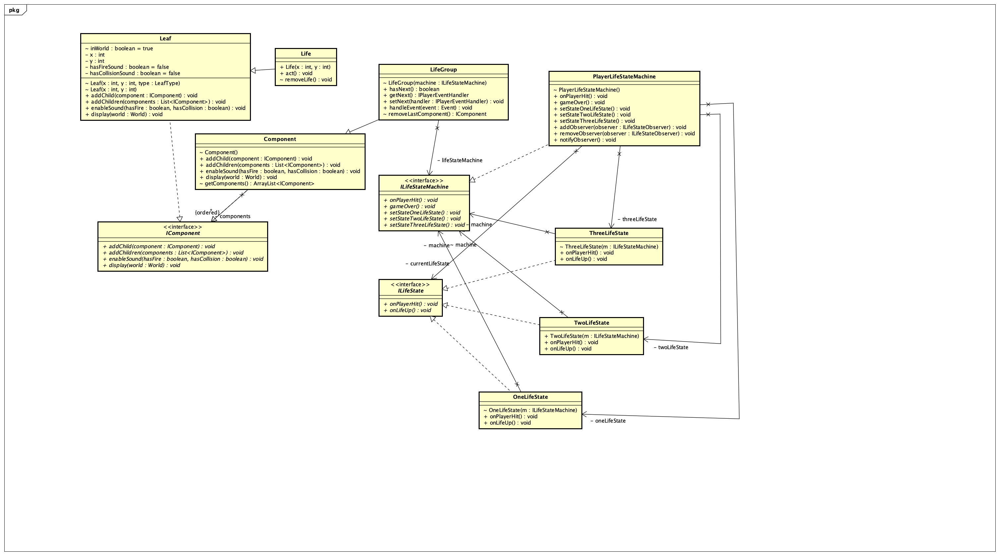
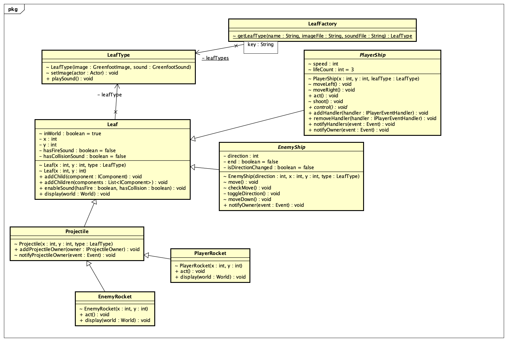
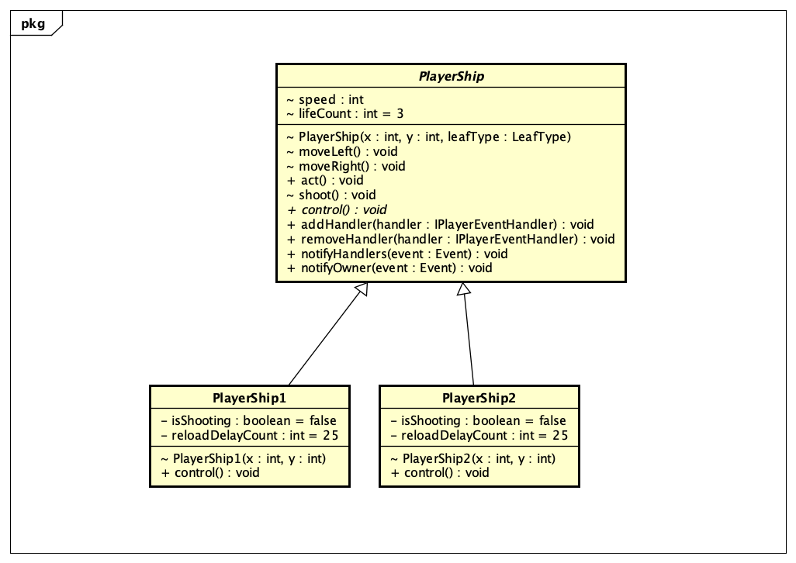
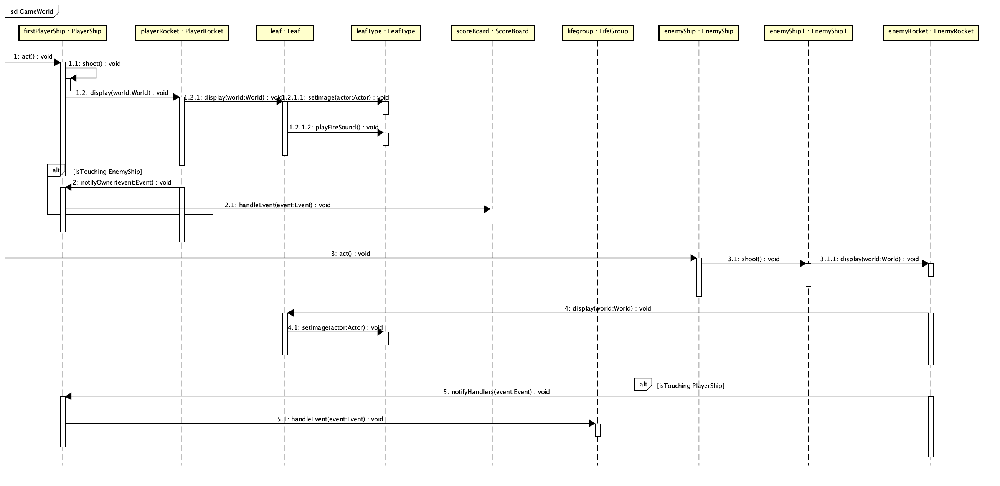
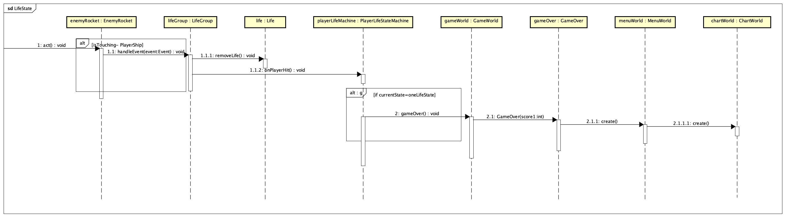

## Topic Name
The Falcon Savior

## Team Name
Hex Clan

## Team Members
* Alok Goyal
* Mitash Gaurh
* Pratyush Sharma
* Shalabh Neema
* Shubhangi Yadav

## Project Summary

Inspired from star wars saga, our game features the fastest starship - "The Millenium Falcon" driven by our hero of galaxy - Han Solo. Han has to fight againt an army of Darth Vadar by destroying his personal & powerful ship - Death star along with the commander ship - Star Destroyer and its associate enemy ships - Lambda-class T-4a & TIE Fighter and led the rebel alliance to its glorious victory.

## Summary of key features

### Command Pattern

**What is it?** 
Encapsulate a request as an object, thereby letting you parameterize clients with different requests, queue or log requests, and support undoable operations.

**Participants:** 
* Command - IMenuCommand
* Concrete Command - singlePlayerCommand, twoPlayerCommand, helpCommand
* Client Invoker - singlePlayerButton, twoPlayerButton, helpButton (implements IMenuInvoker)
* Receiver - IMenuReceiver

**Feature:**
Menu world feature and options

### Composite Pattern

**What is it?** 
Compose objects into tree structures to represent part-whole hierarchies. Composite lets clients treat individual objects and compositions of objects uniformly.

**Participants:** 
* Component: IComponent
* Leaf: Level, EnemyShip1, EnemyShip2, Life, PlayerShip1, PlayerShip2, EnemyRocket, PlayerRocket, ScoreBoard
* Composite: Component
* Client: GameWorld

**Feature:**
Game world

### Chain Of Responsibility Pattern

**What is it?** 
Avoid coupling the sender of a request to its receiver by giving more than one object a chance to handle the request. Chain the receiving objects and pass the request along the chain until an object handles it.

**Participants:** 
* Handler: IPlayEventHandler
* Concrete Handler: ScoreBoard, LifeGroup

**Feature:**
PlayerShip, ScoreBoard, LifeGroup,  

### Observer Pattern

**What is it?** 
Define a one-to-many dependency between objects so that when one object changes state, all its dependents are notified and updated automatically.

**Participants:** 
* Subject: ILevel
* Observer: ILevelObserver
* Concrete Subject: Level
* Concrete Observer: GameWorld

**Feature:**
Levels, PlayerLifeState

### Decorator Pattern

**What is it?** 
Attach additional responsibilities to an object dynamically. Decorators provide a flexible alternative to subclassing for extending functionality.

**Participants:** 
* Decorator: SoundDecorator
* Concrete Decorator: DualSoundDecorator, FireSoundDecorator, CollisionSoundDecorator

**Feature:**
Sound

### Strategy Pattern

**What is it?** 
Define a family of algorithms, encapsulate each one, and make them interchangeable. Strategy lets the algorithm vary independently from clients that use it.

**Participants:** 
* Strategy: ILevelStrategy
* Concrete Strategy: Level1, Level2

**Feature:**
Loading enemy troops based on current level

### State Pattern

**What is it?** 
Allow an object to alter its behavior when its internal state changes. The object will appear to change its class.

**Participants:** 
* Context
* State
* Concrete State

**Feature:**
Player life state

### Flyweight Pattern

**What is it?** 
Use sharing to support large numbers of fine-grained objects efficiently.

**Participants:** 
* Flyweight: LeafType
* Concrete Flyweight: PlayerShip1, PlayerShip2, EnemyShip1, EnemyShip2, 
* Flyweight Factory: LeafFactory
* Client: 

**Feature:**
Image & sound reuse

### Template Pattern

**What is it?** 
Define the skeleton of an algorithm in an operation, deferring some steps to subclasses. Template Method lets subclasses redefine certain steps of an algorithm without changing the algorithm’s structure.

**Participants:** 
* Abstract Class: PlayerShip
* Concrete Class: PlayerShip1, PlayerShip2

**Feature:**
Movement of playerships

### Use Case Diagram:

### Sequence Diagram

